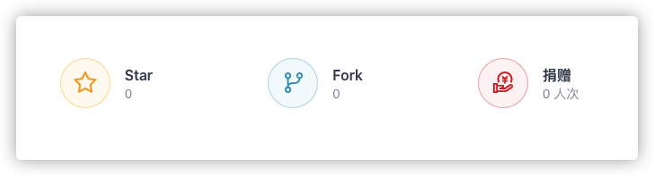

<h1 align="center">super-antd</h1>

    

    

`super-antd` 是一个简单且数据驱动友好的 React 组件库。它基于 [ant design](https://ant.design/) 和 [pro-components](https://procomponents.ant.design/) 。

## 📖 Document

[https://dream2023.github.io/super-antd](https://dream2023.github.io/super-antd)

## ✨ Feature

- 简单：通过对大量业务场景的提炼和抽象，使得其十分简单；
- 数据驱动友好：在组件层级解决了动态渲染、通信、联动等难题；
- 稳定：Typescript 编写 + 90% 以上的测试覆盖率；

## 🤔 Why？

业界尤其是一线程序员关于低代码有很多负面评价，例如**行业毒瘤**、**拖拽一时爽，重构火葬场**等。

这些负面评价当然不是空穴来风，而是由于很多低代码系统在开始做时经验不足，导致整体架构**灵活性、扩展性差**，随着业务发展，低代码平台已无法满足个性化需求，无奈之下，只能从头写一遍。

所以低代码平台的核心在于其**灵活性**，那如何尽可能增加其灵活性呢？

很多低代码系统走了弯路，在低代码编辑器上做各种骚操作，例如各种钩子的注入，让用户在界面上写恶心人的函数等，这样的最终后果就是上层编辑器越来越臃肿，并最终难以适应需求的变化而废弃。

`super-antd` 则给出了一条不一样的路，在组件层级解决灵活性的问题，例如 `联动`、`数据映射`、`schema 渲染`、`组件间通信`，这样上层的低代码编辑器只是一层简单的封装和组合，并无复杂的逻辑。

而且 `super-antd` 本身其实就是一个普通的 `antd` 组件库，当低代码编辑器真的无法满足需求而需要重构，导出的代码也和程序员真实开发时写的一样，这样就极大的降低重构的风险和成本，这就是为什么要写 `super-antd`。

## 🎯 RoadMap

- [x] 0.1 alpha 版
  - [x] [数据模板](https://dream2023.github.io/super-antd/guide/concept/template)
  - [x] [数据联动](https://dream2023.github.io/super-antd/guide/concept/linkage)
  - [x] [数据请求](https://dream2023.github.io/super-antd/guide/concept/api)
  - [x] [schema 动态渲染](https://dream2023.github.io/super-antd/guide/concept/schema)
  - [x] [表单组件](https://dream2023.github.io/super-antd/components/form)
  - [x] [表单项组件](https://dream2023.github.io/super-antd/components/form/form-item)
  - [x] [内置表单组件](https://dream2023.github.io/super-antd/components/form/form-components)
- [x] 0.1 正式版
  - [x] 测试覆盖率 90% 以上
  - [x] 完成 100% 文档
  - [x] 0️⃣ issue
- [ ] 1.0 版
  - [ ] 模板组件
  - [ ] 富文本组件
  - [ ] 上传图片组件
  - [ ] 上传视频组件
  - [ ] 代码编辑器组件
  - [ ] ...

更详细规划请见 [https://github.com/dream2023/super-antd/projects](https://github.com/dream2023/super-antd/projects)。

## 👬 Ecosystem

其实 `super-antd` 仅是一个大系统中的一部分，我个人是希望做一个支 **持海量组件的高扩展通用型** 的低代码平台，此平台包括以下组件部分：

| Project | Status | Description |
| --- | --- | --- |
| react-schema-render |  | 通用型 schema 转 React 组件的工具组件 |
| @dream2023/data-mapping |  | 数据模板映射方案 |
| super-antd |  | 简单且数据驱动友好的 React 组件库 |

此外至少还有以下系统待开发：

- 基于 `super-antd` 属性面板系统（时间点：组件库发布 0.3 版后）
- 组件库无关的低代码编辑器（时间点：属性面板完成后）
- 一个开放性的组件市场（时间点：低代码编辑器完成后）

虽然要做的东西很多，但整体思路还是很清晰的，期待都实现的一天。

## support

开源不易，如果你觉得项目对自己和公司有用，请跳转到 [gitee](https://gitee.com/dream2023/super-antd#Support) 底部进行打赏，并且可以多留言鼓励作者一下，你的支持就是我更新的动力！

